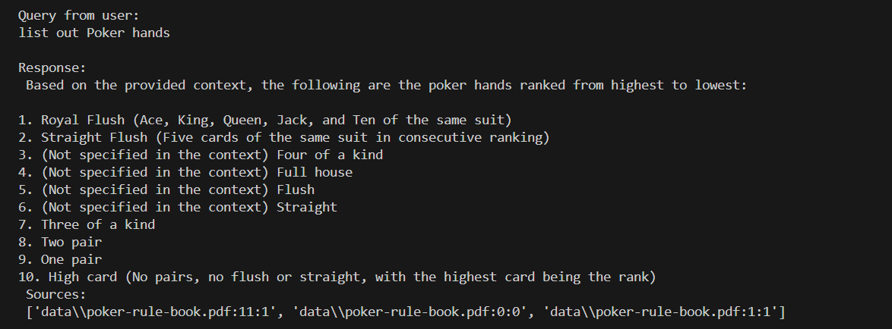
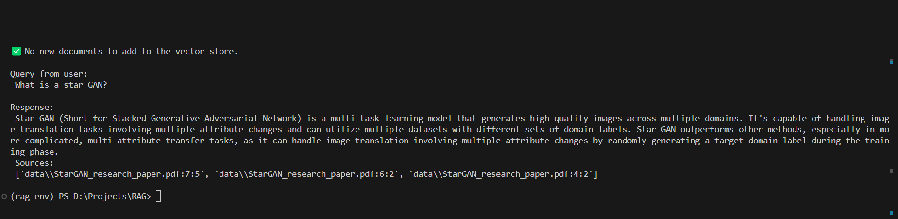

## **RAG-based Information Retrieval System from PDF files Using LangChain and Mistral LLM**

## Introduction

This project demonstrates a Retrieval-Augmented Generation (RAG) system for processing local PDF data. The RAG framework leverages the strength of three key components: **Retrieval**, **Augmentation**, and **Generation**.

- **Retrieval**: The system begins by retrieving relevant data. When a user query is made, the system searches through preprocessed document chunks stored in a vector database (in this case, FAISS) to return the most relevant information.
  
- **Augmentation**: The retrieved information is then augmented by embedding techniques, where each document is converted into vector representations. These embeddings help map queries to documents based on their semantic similarity, ensuring the returned results are more relevant to the user's input.

- **Generation**: Finally, the system uses a language model (LLM) to generate a more comprehensive and accurate response. The Mistral LLM, integrated in this project, refines the retrieved information to present the user with an informative and accurate response in natural language.

This RAG system allows users to query large amounts of PDF data locally, providing more informed and accurate results by combining retrieval and generation capabilities.

---

## Methodologies

### 1. **Data Loader**
The data loader is responsible for reading and chunking the documents to make them ready for embedding and storage. In this project, we used Langchain's `Document Loader` to load PDF files, followed by chunking them into smaller, manageable pieces of text. This allows better document representation when retrieving relevant sections during the query process.

- **Code**: See [`data_loader.py`](data_loader.py)

### 2. **Data Embeddings**
Embeddings convert text chunks into vector representations. I used the **Nomic-embed-text** embedding model from Ollama, which effectively encodes chunks into high-dimensional vectors. These embeddings allow for semantic similarity searches within the vector database. 

- **Embedding Model**: `nomic-embed-text`
- **Code**: See [`data_embeddings.py`](data_embeddings.py)

### 3. **Vector Database**
The vector database is the backbone of the retrieval process. In this project, **FAISS** (Facebook AI Similarity Search) is used as the vector store. FAISS stores the document embeddings and allows for fast and efficient similarity searches when a query is made. When a user query is provided, the system retrieves the top relevant chunks based on cosine similarity.

- **Code**: See [`vector_database.py`](vector_database.py)

### 4. **LLM Integration**
To generate the final response, the project integrates the **Mistral LLM**. After retrieving relevant chunks from the FAISS database, the Mistral model takes over to refine and enhance the output. The model processes both the user query and retrieved documents to produce coherent and informative responses. This integration ensures that the response is not just a retrieval but a generation of well-formed and contextual answers.

- **Code**: See [`main.py`](main.py)

---

## How to Run

To run this project, follow these steps to install the necessary dependencies and set up your environment:

### 1. **Install Dependencies**

You have two options to install the required dependencies:

#### a. Using `requirements.txt` with `pip`:

If you prefer using `pip`, run the following command to install the dependencies listed in the `requirements.txt` file:

```bash
pip install -r requirements.txt
```
#### b. Using `environment.yml` with `conda`:

Alternatively, if you're using Conda, you can create a Conda environment and install the dependencies specified in the environment.yml file:

```bash
conda env create -f environment.yml
```

### 2. **Install Mistral Model**

After installing the dependencies, you'll need to install the Mistral model using ollama. Run the following command:

```bash
ollama pull mistral
```

### 3. **Run The Application** 
Once all dependencies and the Mistral model are set up, you can run the project by executing the following command:

```bash
python main.py
```
### 4. **Provide Your Query**
After starting the application, you'll be prompted to enter a query. The system will retrieve relevant chunks from your local PDF data and generate a response.

## Output Samples


For the user query to list out poker hands, the RAG application gives out the response as shown in the output screenshot along with sources it go the data from.


The RAG architecture gives information about starGAN. This shows the RAG architecture can be helpful in getting quick information from research papers.


